# Sistem Mimarisi Diyagramları
## Türkiye'nin Kıvılcımları Topluluk Platformu

Bu dokümanda sistemin çeşitli katmanlarını ve bileşenlerini görselleştiren Mermaid diyagramları bulunmaktadır.

---

## 🏗️ Genel Sistem Mimarisi

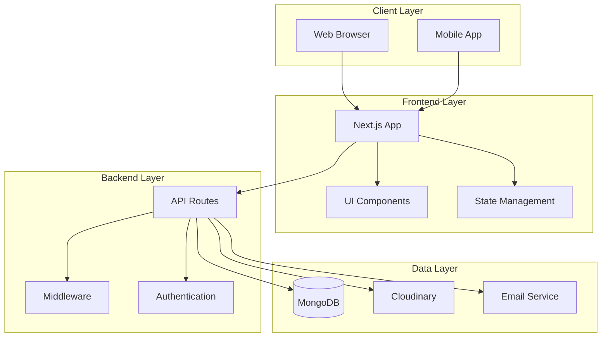

---

## 🔐 Kimlik Doğrulama Akışı

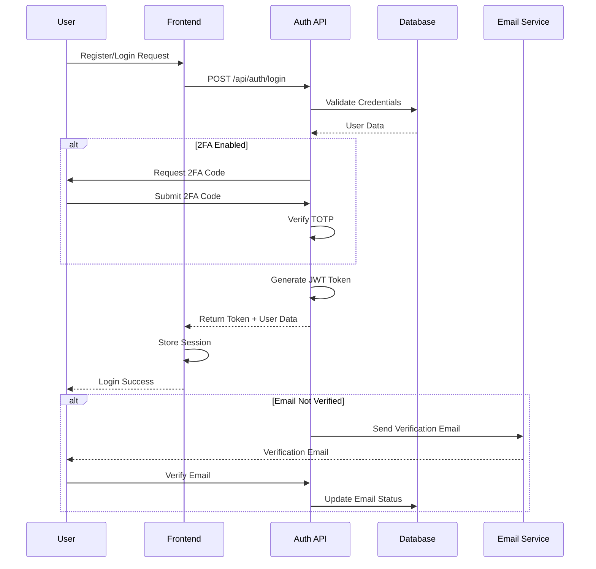

---

## 📊 Veritabanı İlişki Diyagramı

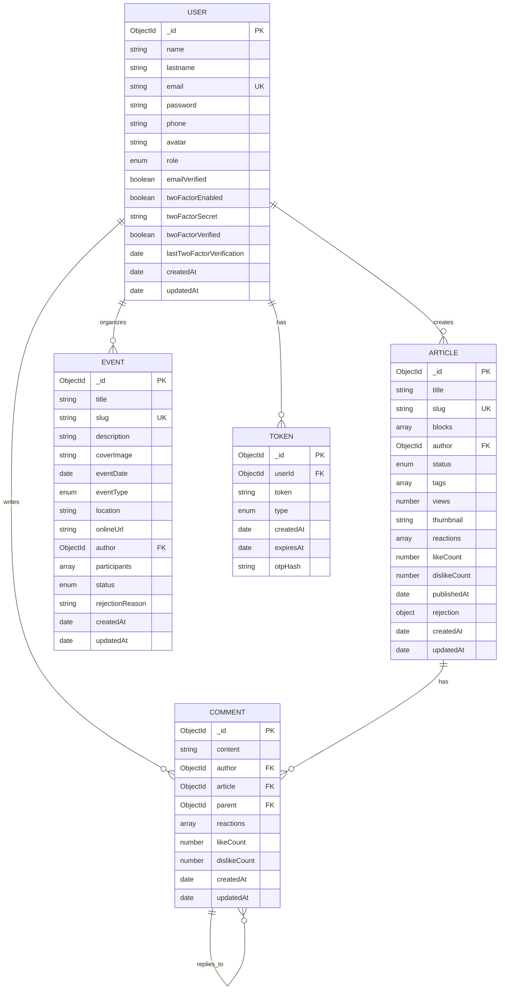

---

## 🌐 API Endpoint Mimarisi

```mermaid
graph LR
    subgraph "Public APIs"
        PUB_ART[/api/public/articles]
        PUB_AUTH[/api/public/authors]
        PUB_TAGS[/api/public/tags]
    end
    
    subgraph "Authentication APIs"
        AUTH_REG[/api/auth/register]
        AUTH_LOGIN[/api/auth/login]
        AUTH_2FA[/api/auth/2fa/*]
        AUTH_RESET[/api/auth/reset-password]
    end
    
    subgraph "User APIs"
        USER_ME[/api/users/me]
        USER_LIST[/api/users]
        USER_DETAIL[/api/users/id]
    end
    
    subgraph "Content APIs"
        ART_LIST[/api/articles]
        ART_DETAIL[/api/articles/id]
        EVENT_LIST[/api/events]
        EVENT_DETAIL[/api/events/slug]
        COMMENT_LIST[/api/articles/id/comments]
    end
    
    subgraph "Admin APIs"
        ADMIN_USERS[/api/admin/users]
        ADMIN_ARTICLES[/api/admin/articles]
        ADMIN_EVENTS[/api/admin/events]
        ADMIN_COMMENTS[/api/admin/comments]
        ADMIN_STATS[/api/admin/stats]
    end
    
    subgraph "Utility APIs"
        UPLOAD[/api/upload]
        CONTACT[/api/contact]
    end
```

---

## 🔄 Makale Yayınlama Süreci

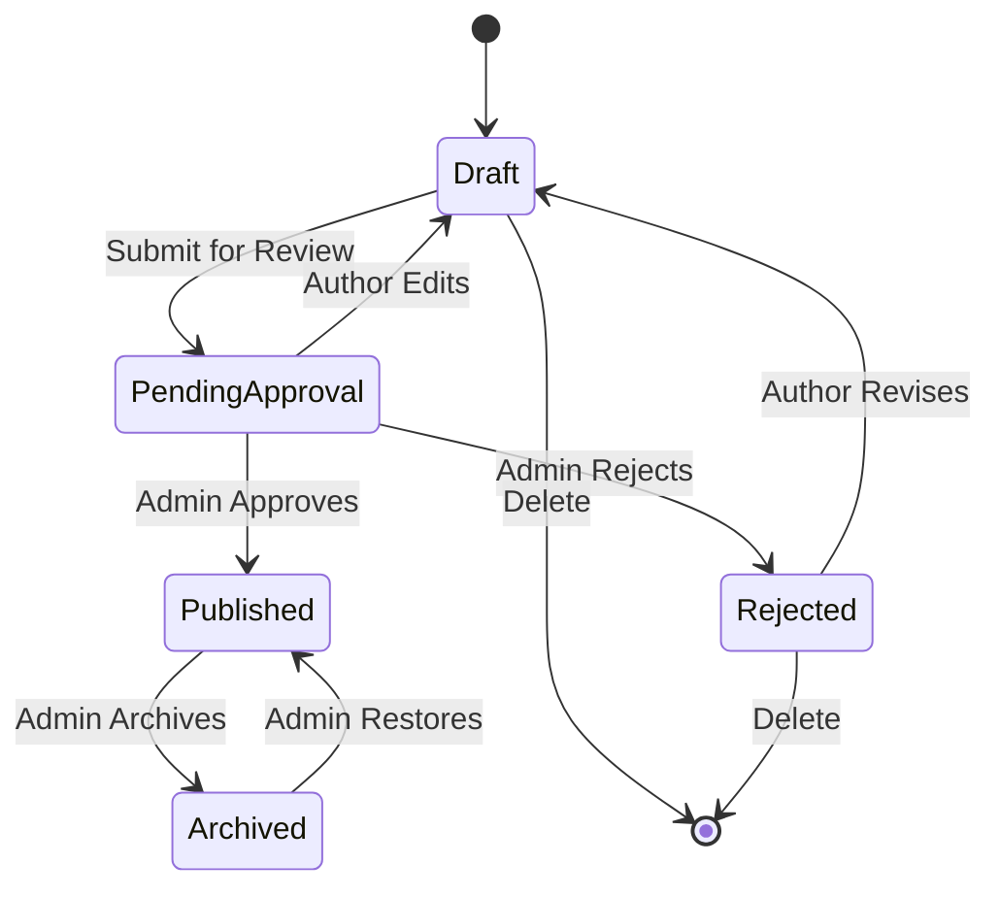

---

## 🎯 Etkinlik Yaşam Döngüsü

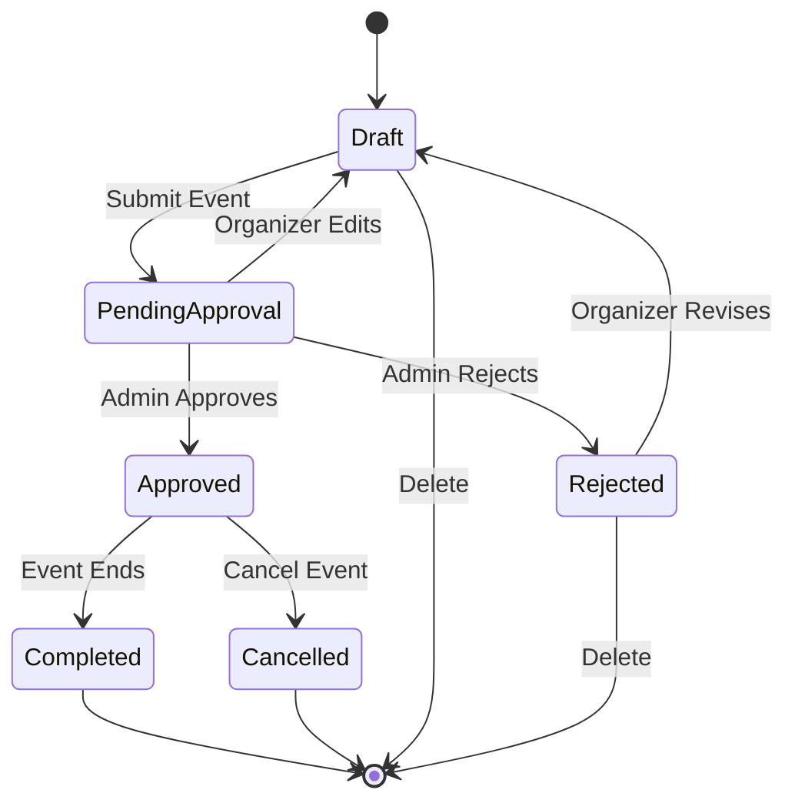

---

## 🛡️ Güvenlik Katmanları

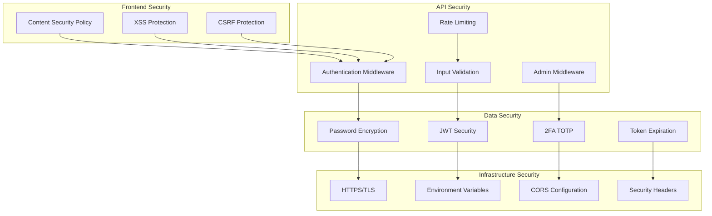

---

## 📱 Bileşen Hiyerarşisi

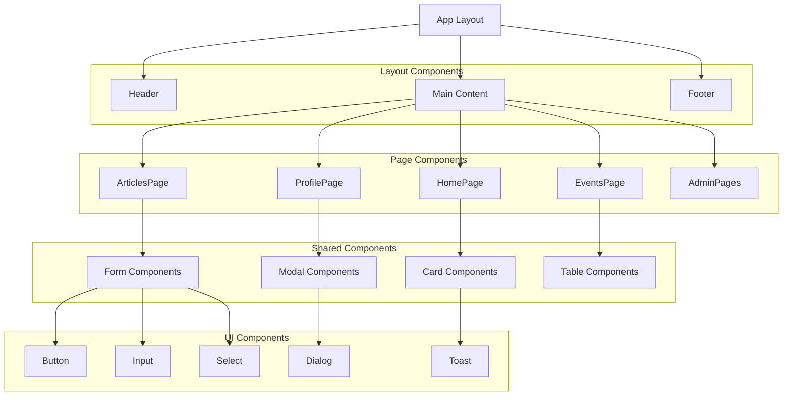

---

## 🔄 State Management Akışı

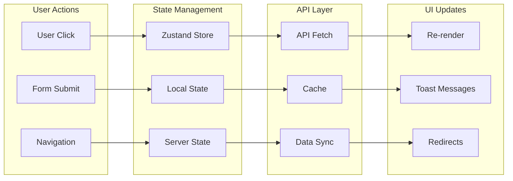

---

## 📊 Veri Akış Diyagramı

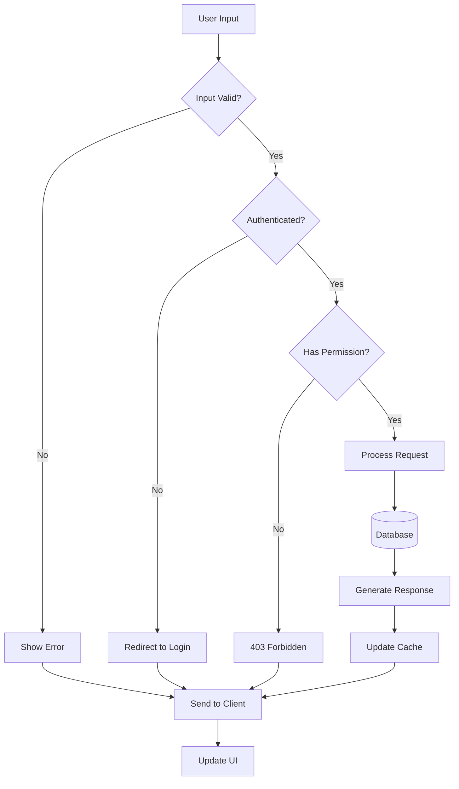

---

## 🚀 Deployment Mimarisi

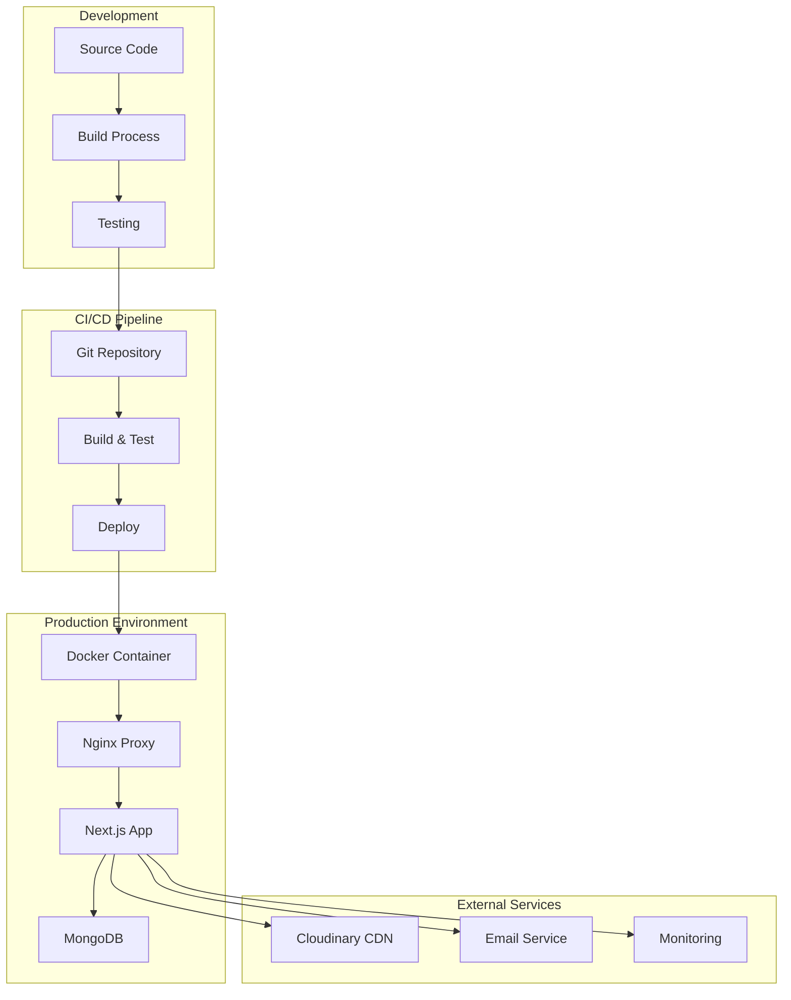

---

## 📈 Performans Optimizasyon Stratejisi

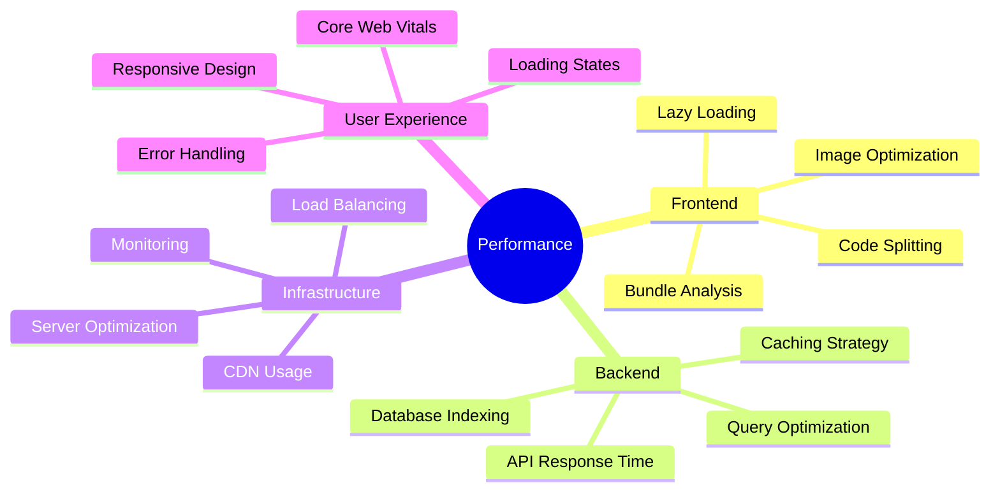

---

## 🔍 Monitoring ve Logging

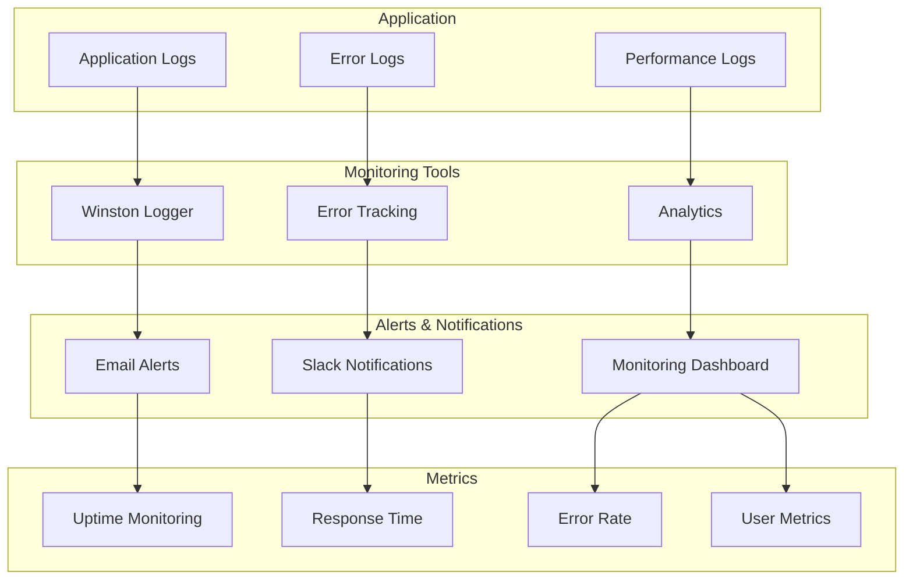

---

*Bu diyagramlar, sistemin farklı katmanlarını ve bileşenler arası ilişkileri görselleştirmek için hazırlanmıştır. Sistem geliştikçe güncellenmelidir.*

**Son Güncelleme**: 18 Ağustos 2025
**Versiyon**: 1.0.0